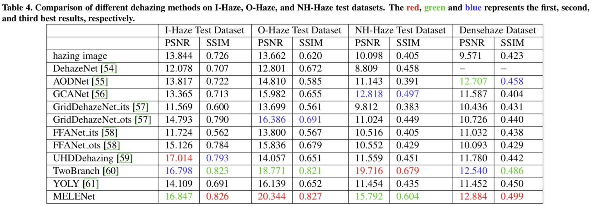

# MELENet

This repository is the official implementation of "MELENet: Multi-Resolution Edge-aware Lighting Enhancement Network"

MELENet can be used for low light image enhancement or image dehazing and achieve excellent results.

Our model is implemented based on PaddlePaddle. In order to quickly get started, we have provided the converted ONNX model and corresponding prediction code, even though the ONNX model may slightly reduce the performance.

## Requirements

```shell
python 3.7
onnxruntime
opencv-python
```

Install onnxruntime-gpu instead of onnxruntime to support GPU prediction.

```
pip install onnxruntime-gpu
```

## Prediction

```
cd MELENet/
pip install -r requirements.txt
```

***For Lowlight Image Enhancement:***
You can download weights from [Google Drive](https://drive.google.com/file/d/1YAaUmk_CQq2IMIeIlYzRK_5t_hE0hD3u/view?usp=drive_link).

```
python infer_demo_onnx.py --model_path weights/MELENet-llie.onnx --image_path test_images/lowlight_images/test_data/ --save_dir results/result_MELENet-lowlight
```

***For Image Dehazing:***
You can download weights from [Google Drive](https://drive.google.com/file/d/1klY0plyRKeHV8nar5yiSBtI27Z_BG5V-/view?usp=drive_link).

```
python infer_demo_onnx.py --model_path weights/MELENet-dehaze.onnx --image_path test_images/dehaze_images/test_data/ --save_dir results/result_MELENet-dehaze
```


## Performance Evaluation

***Lowlight Image Enhancement***

Quantitative comparison on LOL dataset about MSE, PSNR, SSIM, LPIPS and DISTS. The highlighted in bold represents the best results.


Quantitative comparison on O-HAZE dataset, I-HAZE dataset, NH-HAZE dataset and Densehaze dataset about PSNR and SSIM. The highlighted in bold represents the best results.



